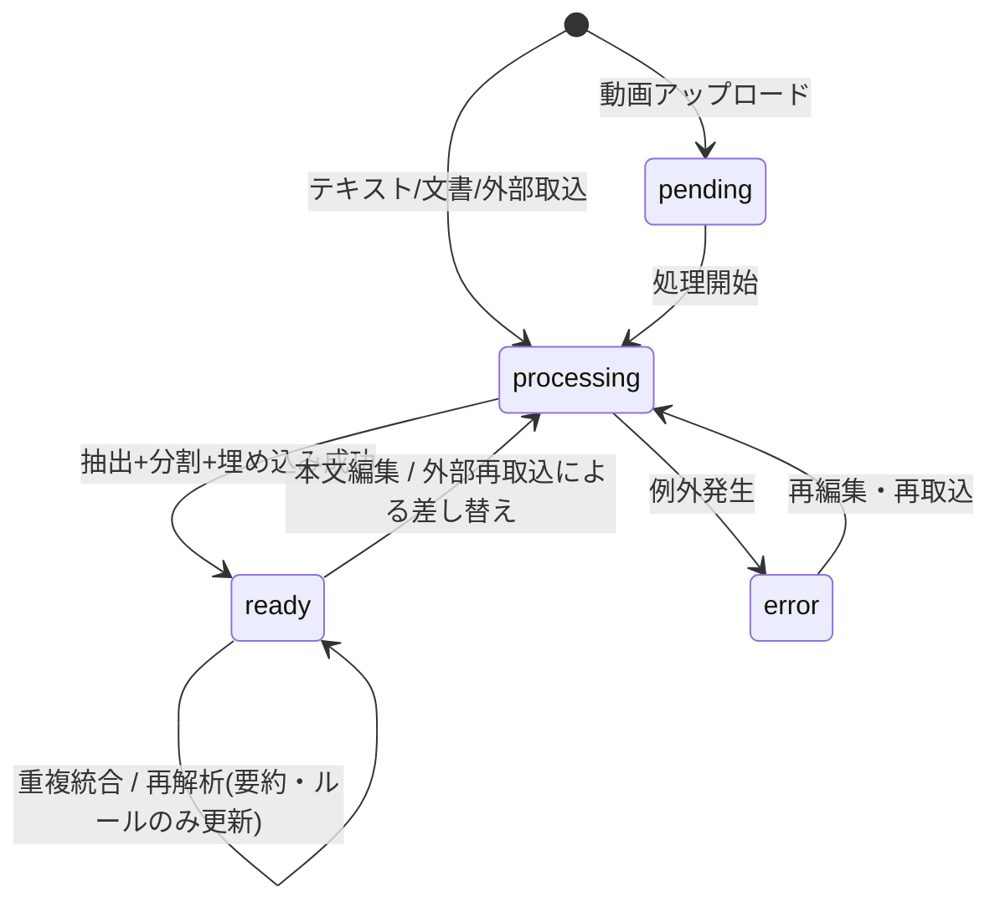
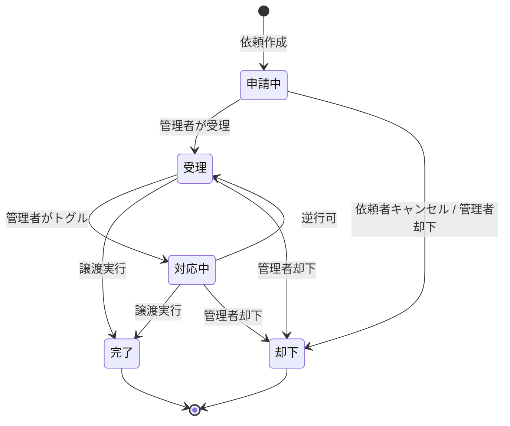
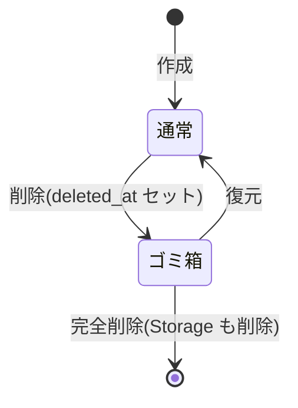
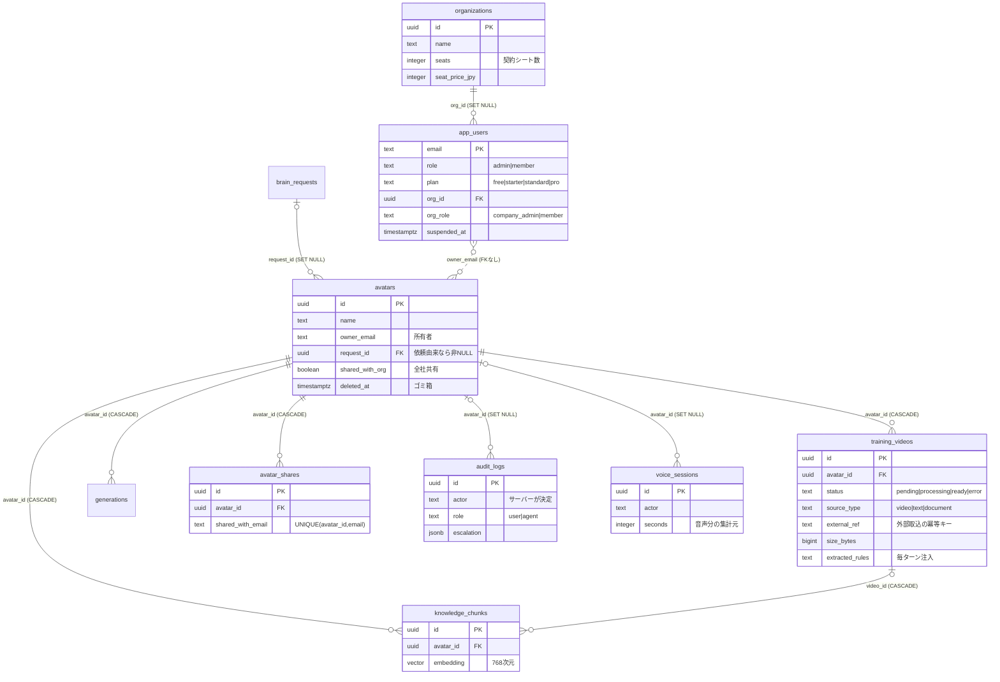

# CompanyBrain AI 要件定義書 v1.0

| 項目 | 内容 |
|---|---|
| プロダクト | CompanyBrain AI — 日本語社内ナレッジ AI |
| 版数 | v1.0(初版・実装済み範囲の確定版) |
| ステータス | **確定**(料金は現行価格で凍結。§10 の未決事項は次フェーズ) |
| 検証状況 | **受け入れ基準(§8)は全項目クリア**。本番リリース済み・本番DB適用済み |
| 作成方針 | 実装済みコードを正として文書化(リバース要件定義) |
| 対象コミット | `df98a1a` 時点 |

> **本書の位置づけ**
> 本プロダクトは実装が先行し、要件書が後追いで整備された。本書は**現在の実装を「確定した要件」として凍結**し、未確定事項(§10)と次フェーズ候補(§11)を切り分けることを目的とする。以後の変更は本書を起点とする。

---

## 1. 概要

### 1.1 目的

社員個人の頭の中にある知識(業務手順・判断基準・社内ルール)は、その人が退職・異動すると失われる。本システムは、**人物の話し方と知識を学習した AI(以下「ブレイン」)を作り、音声・テキストで会話できるようにする**ことで、属人化した知識を組織の資産として残す。

### 1.2 対象業務

社内での「あの人に聞かないと分からない」が発生するすべての場面。経理処理の判断、現場作業の手順、就業規則の解釈、営業ノウハウなど。

### 1.3 期待効果(KPI)

| KPI | 目標 | 測定方法 |
|---|---|---|
| 質問対応時間の削減 | 1人あたり **1日15分**(月約5時間) | 監査ログの質問件数 × 想定調査時間 |
| ベテラン社員の割込み削減 | 週あたり問い合わせ **30%減** | 導入前後の聞き取り |
| ナレッジ検索の自己解決率 | **60%以上** | 「解決した」評価(高評価)の比率 |

ROI 換算: 時給 ¥2,000 想定で月 ¥10,000/人 の削減効果。スタンダードプラン(¥19,800/月)は 2 名分の利用で回収。

---

## 2. 制約条件

### 2.1 利用環境

| 項目 | 内容 |
|---|---|
| 主要デバイス | **スマートフォン**(iOS 16 以降 / Android 12 以降、Safari・Chrome) |
| 補助デバイス | PC(Windows / Mac、Chrome・Edge・Safari) |
| 通信環境 | 常時オンライン前提。**オフライン対応は行わない** |
| マイク | 音声会話にはマイク許可が必須。不許可時はテキスト会話にフォールバック |
| 実行基盤 | Vercel(Node.js **22.x** 固定)、Supabase(PostgreSQL + pgvector + Storage + Auth) |
| AI 基盤 | Google Gemini(回答・埋め込み・文字起こし)、Gemini Live API(リアルタイム音声) |

### 2.2 利用者

| 項目 | 内容 |
|---|---|
| 主対象 | **地方 SME**(岩手・東北の建設/製造/電気工事など)**および都市部の中堅企業** |
| 想定年齢 | 20代〜60代。**高齢層を含む前提で設計する** |
| IT リテラシー | スマホで LINE・写真撮影ができるレベルを下限とする |
| UI 方針 | 文字は太め・大きめ。下部ナビ(質問する/お知らせ/マイページ)を主動線とする。**アプリ内 UI では絵文字アイコンを使わない**(マーケ用ランディングは SVG アイコン可) |
| 言語 | 日本語。音声認識は多言語対応(自動検出可) |

### 2.3 既存システム連携

| システム | 連携 |
|---|---|
| 会計・給与・勤怠 | **連携しない** |
| 外部自動化(Make.com 等) | **連携する**(`/api/ingest/train-text`、Bearer トークン認証) |
| e-Gov 法令 API | **連携する**(`/api/ingest/egov-law`、法令全文の条文単位取込) |
| 決済代行(Stripe 等) | **連携しない**(現行は請求書・銀行振込の手動運用) |

### 2.4 紙・FAX 運用との並走

本システムは紙帳票を代替しない。請求は**請求書(PDF/郵送)・銀行振込**で運用し、システム内に決済機能を持たない。

---

## 3. やること / やらないこと

### 3.1 本フェーズで実装する機能(実装済み・確定)

1. ブレインの作成・編集・削除(ゴミ箱・復元)
2. 学習素材の投入(テキスト貼付 / 文書ファイル / 動画)と管理(フォルダ・重複統合・再解析)
3. Gemini Live によるリアルタイム音声会話、およびテキスト会話
4. RAG(pgvector 意味検索)による根拠に基づく回答
5. 会話履歴(スレッド管理・検索・ピン・評価・Markdown 書き出し)
6. 監査ログ(全質問・回答のサーバー保存)
7. 招待制アカウント + セルフ登録、プラン制限の実 enforce
8. ブレイン作成依頼ワークフロー(依頼 → 受理 → 対応中 → 完了/却下、譲渡はコピー)
9. エンタープライズ(組織テナント・シート課金・会社管理者)
10. **ブレイン共有**(同一組織内・閲覧/会話のみ)
11. お知らせ配信(管理者・会社管理者)
12. 外部連携取込(Make.com、e-Gov 法令)

### 3.2 本フェーズで実装しないこと(明示的なスコープ外)

| 項目 | 理由 |
|---|---|
| **アプリ内決済**(クレジットカード自動課金) | 請求書・銀行振込の手動運用とする。Stripe 連携は次フェーズ候補(`docs/billing-design.md` は未実装の提案) |
| **動画の自動生成**(話す動画の出力) | 廃止済み。Gemini Live による音声会話に一本化 |
| **表情・見た目の再現**(動画アバター) | 学習するのは声のトーン・話し方・口癖まで |
| **オフライン動作** | 常時オンライン前提 |
| **SSO / SAML** | 次フェーズ候補 |
| **チャット画面の会話スレッドのサーバー同期** | **意図的な仕様**。スレッド表示は端末ごとに独立(localStorage)。会話内容自体は監査ログにサーバー保存されるため消えない |
| **画像だけの PDF の読み取り(OCR)** | 文字情報を持つ文書のみ対応 |
| **回答の出典表示** | 次フェーズ候補(現在は内部的に根拠チャンクを参照するが UI 表示なし) |
| **メール・LINE 等への外部通知** | アプリ内お知らせのみ |
| **ゴミ箱の自動パージ** | 手動削除のみ(自動削除 cron は無い) |

---

## 4. 機能仕様

各機能を Who / When / Where / What / Why / How + 例外 で定義する。

### 4.1 ブレインの作成

| 項目 | 内容 |
|---|---|
| **Who** | ログイン済みの全ユーザー(所有者となる) |
| **When** | 新しい知識の受け皿が必要になったとき |
| **Where** | スマホ / PC(`/avatars/new`) |
| **What** | ブレイン(名前・説明・アイコン写真・初期学習素材) |
| **Why** | 人物や業務領域ごとに知識をまとめ、会話できる単位を作る |
| **How** | ダッシュボード →「＋ 新しいブレイン」→ 2 モードから選択 |

**入力項目**

| 項目名 | 型 | 必須 | 例値 | 備考 |
|---|---|---|---|---|
| 名前 | text | はい | 経理ヘルプデスク | 未入力時は「名称未設定」 |
| 説明 | text | いいえ | 経費精算の相談役 | — |
| アイコン写真 | image | いいえ | (JPEG) | 正方形にトリミング |
| 初期テキスト | text | いいえ | 出張旅費規程の全文 | 投入時に自動でチャンク+埋め込み |
| 動画 | video | いいえ | (MP4) | 1ファイル 50MB まで。フレーム抽出でアイコン化 |
| フォルダ | text | いいえ | 規程 | 初期素材の分類 |

**例外パターン**

1. **プランのブレイン数上限に達している** → 403 とプラン上限メッセージを返し、作成しない(管理者は制限対象外)
2. **動画の処理(ffmpeg / 文字起こし)に失敗** → 作成したブレイン行とストレージを**ロールバック削除**し、孤児を残さない
3. **素材容量がプラン上限を超える** → 403。直接アップロード経路では staged ファイルも削除する
4. **名前が空文字** → 「名称未設定」として作成する(エラーにしない)

---

### 4.2 学習素材の投入

| 項目 | 内容 |
|---|---|
| **Who** | ブレインの**所有者のみ**(共有相手は不可) |
| **When** | 知識を追加・更新したいとき |
| **Where** | スマホ / PC(ブレイン詳細の「学習させる」、または `/avatars/[id]/training`) |
| **What** | テキスト / 文書ファイル / 動画 |
| **Why** | 投入するほど回答の精度と本人らしさが上がる |
| **How** | タブで種別を選び、入力または選択して送信。抽出 → 分割 → 埋め込み → 「理解」(要約+振る舞いルール抽出)を実行 |

**対応形式**

| 種別 | 形式 | 上限 | 抽出方法 |
|---|---|---|---|
| テキスト | 直接貼り付け | — | そのまま |
| 文書 | PDF / Word(.docx) / Excel(.xlsx,.xls) / CSV / テキスト(.txt,.md) | 15 MB | PDF: unpdf、Word: mammoth、Excel: xlsx、CSV/テキスト: UTF-8 直読み |
| 動画 | MP4 等 | 50 MB | Gemini による文字起こし |

抽出テキストは **最大 200,000 文字**で切り詰める。原本ファイルは保存せず、抽出テキストのみ保持する(動画を除く)。

**例外パターン**

1. **依頼で作成されたブレイン**(`request_id` 非 NULL) → 素材ロック。403 `request_brain_locked` を返す
2. **画像だけの PDF 等でテキストが抽出できない** → 400 と「テキストを抽出できませんでした」を返し、素材行を作らない
3. **対応外の形式** → 400 と対応形式の案内を返す
4. **素材容量がプラン上限超過** → 403(管理者は対象外)
5. **`size_bytes` 列が未適用の DB** → 当該列を外して再挿入し、アップロード自体は成功させる(容量計上のみ無効)
6. **レート制限**(20回/分)超過 → 429

---

### 4.3 音声・テキスト会話

| 項目 | 内容 |
|---|---|
| **Who** | ブレインの**所有者**、および**共有された同一組織のメンバー** |
| **When** | 疑問が生じたとき(業務中・移動中) |
| **Where** | 主にスマホ(ブレイン詳細画面) |
| **What** | 質問(音声 or テキスト)と、その人の口調による回答 |
| **Why** | 担当者に聞かずに即座に answers を得る |
| **How** | 押して話す(push-to-talk)方式。サーバーが短命トークンを発行し、ブラウザが Gemini Live へ直接接続 |

**回答生成の仕組み**

1. **ハイブリッド検索**で関連チャンクを上位8件取得する。
   - **キーワード完全一致**: 質問からカタカナ・漢字・英数字の連続を語として抜き出し、`knowledge_chunks` を部分一致で検索する。定型文の多い規程では、固有語を含む条文が意味検索の上位に入らないため必須(§8.4)。上限の半分までを割り当てる。
   - **意味検索**: 質問を埋め込みベクトル化し `match_knowledge_chunks` で類似チャンクを取得。言い換えや文脈での一致を拾い、残りの枠を埋める。
   - 意味検索が失敗してもキーワード側の結果は返す(全滅させない)。
2. 素材から抽出した**振る舞いルール(`extracted_rules`)を毎ターン必ず注入**(RAG のヒットに依存しない)
3. 所有者が設定した**回答ルール(`persona_prompt`)を最優先**で適用
4. プランに応じたモデル等級で回答生成(管理者は最上位固定)

**例外パターン**

1. **プランに音声が含まれない / 音声上限到達** → Live 接続せず、**テキスト回答モードに自動フォールバック**(追加課金なし)
2. **月間質問数の上限到達** → 403 でセッション自体を拒否
3. **Gemini Live の接続失敗(1008 等)** → クライアントが代替モデルで再試行
4. **高リスクな質問(法務・労務・金銭等)** → 「上長確認推奨」を自動検出し、質問と回答の両方にフラグを立てる
5. **共有相手がゴミ箱内のブレインにアクセス** → 403(所有者の削除がそのまま共有解除になる)

---

### 4.4 ブレイン共有(エンタープライズ)

| 項目 | 内容 |
|---|---|
| **Who** | ブレインの**所有者**、かつ**組織に所属している**ユーザーのみ設定可能 |
| **When** | 自分のブレインを同僚にも使わせたいとき |
| **Where** | ブレイン詳細の「社員に共有」パネル |
| **What** | 共有先(会社全体 / メンバー個別選択) |
| **Why** | 属人的な知識をチームで共有する |
| **How** | パネルで「会社全体に共有」を ON、または個別にメンバーを選択して保存 |

**共有相手の権限:閲覧・会話のみ**

できること: 会話(音声・テキスト)、ブレイン名・説明・アイコンの閲覧
できないこと: 素材の追加・編集・削除、名前・説明の変更、声・言語・回答ルールの変更、削除、共有設定の変更、**素材一覧・会話履歴・回答ルールの閲覧**

**例外パターン**

1. **個人アカウント(組織なし)** → 共有機能自体を持たない(パネル非表示)
2. **プラットフォーム管理者** → 他人のブレインには共有アクセスできない(監査ログのみ)。組織に割り当てられても同様
3. **所有者がゴミ箱に入れた** → 共有相手は即座にアクセス不可
4. **別組織のメンバー** → 共有先に指定できない(サーバー側で自社メンバーに限定)
5. **共有解除** → チェックを外して保存すると即時失効

---

### 4.5 ブレイン作成依頼ワークフロー

| 項目 | 内容 |
|---|---|
| **Who** | 依頼者=全ユーザー、対応者=**プラットフォーム管理者のみ** |
| **When** | 自分で作るのが難しいブレインが欲しいとき |
| **Where** | `/requests`(スマホ / PC) |
| **What** | 依頼(タイトル・用途・人物像・素材・備考) |
| **Why** | 素材整備や設計を運営側が代行する |
| **How** | 依頼作成 → 管理者が受理・対応 → 完成後に**コピーを譲渡**(原本は管理者に残る) |

**例外パターン**

1. **申請中のみ依頼者がキャンセル可能**。受理以降は管理者への連絡が必要
2. **譲渡されたブレインは素材ロック**(内容保全のため追加学習不可)、かつ**プラン上限の対象外**
3. **却下** → 理由を必須で記録し、依頼者に通知
4. **原本の扱い** → 譲渡は複製であり、管理者側の原本は残る

---

## 5. 状態・権限・例外

### 5.1 ステートマシン

#### 学習素材(`training_videos.status`)



> **既知の制約**: 学習処理は**同期実行でキューが無い**。大きな素材でタイムアウトすると `pending` / `processing` の孤児行が残り、自動リカバリ手段が無い(§10-4)。

#### ブレイン作成依頼(`brain_requests.status`)



状態は **5値**(`申請中` / `受理` / `対応中` / `完了` / `却下`)で確定する。

#### ブレインのソフト削除



### 5.2 権限マトリクス

役割は 3 層:**プラットフォーム管理者**(`role='admin'`)/ **会社管理者**(`org_role='company_admin'`)/ **一般ユーザー**。

| 操作 | プラットフォーム管理者 | 会社管理者 | 一般(所有者) | 共有相手 | 未ログイン |
|---|---|---|---|---|---|
| ログイン | ⭕ | ⭕ | ⭕ | ⭕ | ❌ |
| ブレイン作成 | ⭕(上限なし) | ⭕ | ⭕ | ⭕ | ❌ |
| **自分のブレインで会話** | ⭕ | ⭕ | ⭕ | — | ❌ |
| **共有されたブレインで会話** | ❌ | ⭕ | ⭕ | ⭕ | ❌ |
| **他人のブレインの中身を見る** | ❌ | ❌ | ❌ | ❌ | ❌ |
| 素材の追加・編集・削除 | 自分のみ | 自分のみ | ⭕ | ❌ | ❌ |
| 声・言語・回答ルールの変更 | 自分のみ | 自分のみ | ⭕ | ❌ | ❌ |
| ブレインの削除・復元 | 自分のみ | 自分のみ | ⭕ | ❌ | ❌ |
| 共有設定の変更 | — | 自分のブレインのみ | 自分のブレインのみ(組織所属時) | ❌ | ❌ |
| 自分の監査ログ閲覧 | ⭕ | ⭕ | ⭕ | ⭕ | ❌ |
| **他人の監査ログ閲覧** | ⭕ | ❌ | ❌ | ❌ | ❌ |
| 自社メンバーの招待・停止 | ⭕ | ⭕ | ❌ | ❌ | ❌ |
| 全ユーザー管理(role/plan 変更) | ⭕ | ❌ | ❌ | ❌ | ❌ |
| 組織・シート管理 | ⭕ | ❌ | ❌ | ❌ | ❌ |
| お知らせ配信 | ⭕(全員宛) | ⭕(自社のみ) | ❌ | ❌ | ❌ |
| 依頼の受理・却下・譲渡 | ⭕ | ❌ | ❌ | ❌ | ❌ |

**中核ルール**:ブレインは**作成者本人のみ**が利用できる。プラットフォーム管理者も他人のブレインの中身は見られず、**監査ログによる監査のみ**が可能。共有は組織内かつ opt-in の場合に限る。

### 5.3 監査ログ要件

| 項目 | 内容 |
|---|---|
| 記録対象 | 会話の全メッセージ(`role='user'` の質問、`role='agent'` の回答) |
| 記録項目 | ブレイン ID・ブレイン名(非正規化)・セッション ID・**実行者(サーバー側でログイン本人に上書き)**・本文・参照した根拠・エスカレーション判定・日時 |
| 閲覧権限 | 本人は自分の分。**プラットフォーム管理者のみ**が他ユーザー分を閲覧可能 |
| 保管期間 | プランに従う(フリー 3日 / スターター 30日 / スタンダード 180日 / プロ・エンタープライズ 無期限) |
| 改ざん防止 | 実行者はクライアント申告ではなく**サーバー側のセッションから決定**する |
| 削除耐性 | ブレインを削除しても監査ログは残る(`avatar_id` は SET NULL、ブレイン名は非正規化保持) |

---

## 6. データモデル

### 6.1 ER 図



### 6.2 主要エンティティ

| テーブル | 役割 |
|---|---|
| `avatars` | ブレイン本体。所有者・共有設定・ソフト削除を保持 |
| `training_videos` | 学習素材(動画に限らずテキスト・文書も)。本文と抽出ルールを保持 |
| `knowledge_chunks` | RAG 用チャンク + 768次元ベクトル |
| `app_users` | 招待制アカウント台帳。**メールが主キー** |
| `organizations` | 企業テナント。シート数上限を保持 |
| `avatar_shares` | ブレインの個別共有先 |
| `audit_logs` | 会話の監査証跡 |
| `voice_sessions` | 音声利用秒数(プラン集計用) |
| `brain_requests` | ブレイン作成依頼 |
| `notifications` | アプリ内お知らせ(受信者ごとに 1 行) |
| `generations` | テキスト質問の記録 |

### 6.3 認可の実装方式(重要)

**Row Level Security(RLS)は使用していない。** すべてのアクセスは service_role キーを持つサーバー専用クライアント経由で行い、**認可はアプリケーション層(`src/lib/authServer.ts` と各 API ルート)で実装する**。

この設計に伴う制約:
- Supabase の資格情報が漏洩した場合、DB 側の防御は無い
- ブラウザから直接 Supabase を叩く設計変更は**禁止**(全データが露出する)

### 6.4 プラン定義

| プラン | 月額 | ブレイン | 質問/月 | 音声/月 | 素材 | 履歴 |
|---|---|---|---|---|---|---|
| フリー | ¥0 | 1 | 20 | 15分 | 1 MB | 3日 |
| スターター | ¥4,980 | 3 | 300 | 60分 | 30 MB | 30日 |
| スタンダード | ¥19,800 | 8 | 2,000 | 5時間 | 300 MB | 180日 |
| プロ | ¥49,800 | 30 | 8,000 | 10時間 | 2 GB | 無期限 |
| エンタープライズ | ¥2,980〜/シート | 50/人 | 10,000/人 | 20時間/人 | 5 GB/人 | 無期限 |

- 課金単位は**1人あたり**(エンタープライズはシート課金)
- 価格はすべて税別。決済はアプリ外(請求書・銀行振込)
- **質問数は「質問した本人」に計上**する(共有ブレインで同僚が質問しても所有者の枠を消費しない)
- 音声分は `voice_sessions.actor` で本人に計上
- プラットフォーム管理者はプラン制限の対象外

---

## 7. 非機能要件

| 分類 | 要件 |
|---|---|
| **応答性能** | 音声会話の応答は 1〜3 秒以内。テキスト回答は 10 秒以内 |
| **同時利用** | 同一組織で 30 名程度の同時利用に耐えること |
| **データ規模の想定** | 1ユーザーあたりブレイン 50 件・素材 1,000 件、1組織 1,000 シートまでを想定上限とする。これを超える規模は §10-10/11 の対応が前提 |
| **可用性** | 平日日中(9:00–18:00)の稼働を優先。SLA の明示的な保証は行わない |
| **データ保護** | 投入資料・質問・回答は**外部の AI 学習に使用しない** |
| **通信** | 全通信 HTTPS。ファイルは非公開バケット + 署名付き URL(有効期限 1 時間) |
| **認証** | 招待制 allowlist + セルフ登録。停止(`suspended_at`)ユーザーは即時ログイン不可 |
| **秘匿情報** | API キー等は環境変数のみ。コード・ログ・コミットに含めない |
| **バックアップ** | Supabase の標準バックアップに依存(**独自のバックアップ運用は未定義 → §10-5**) |
| **アクセシビリティ** | 文字サイズ・コントラストは高齢層を考慮。WCAG AA 準拠は次フェーズ目標 |

---

## 8. 受け入れ基準

### 8.1 品質ゲート(コミット前に必須)

| 項目 | 基準 | 現状 |
|---|---|---|
| 型チェック | `npx tsc --noEmit` がエラー 0 | ✅ 達成 |
| ビルド | `npx next build` が成功 | ✅ 達成 |
| 単体・統合テスト | `npm test` が全件パス | ✅ **89件パス** |

### 8.2 機能別の受け入れシナリオ

| # | シナリオ | 合格条件 | 状態 |
|---|---|---|---|
| 1 | フリープランで登録し、テキストからブレインを作る | ブレインが作成され会話できる | ✅ |
| 2 | 5形式(PDF/Word/Excel/CSV/テキスト)の文書を学習させる | 全形式で本文が抽出され、内容を質問すると正しく答える | ✅ **完了**。自動テスト(`documentText.integration.test.ts`)+ **本番実機で36ページPDF(183チャンク)の学習と Q&A 6問すべて正答を確認** |
| 3 | 音声会話を行う | 押して話すで 1〜3 秒以内に応答が返る | ✅ |
| 4 | 上限到達時の挙動 | 質問上限で 403、音声上限でテキストへ自動フォールバック | ✅ |
| 5 | 共有:同僚に共有し、相手が会話できる | 会話でき、かつ編集系 UI が一切表示されない | ✅ **完了**(本番実機で確認済み。手順は `docs/共有機能テスト手順.md`) |
| 6 | 共有:編集系 API を直接叩く | すべて 403 が返る | ✅ コードレビュー済 |
| 7 | 依頼 → 譲渡 | コピーが依頼者に渡り、原本が管理者に残る | ✅ |
| 8 | スマホでの並べ替え | 長押しでドラッグでき、重なっても振動しない | ✅ 実機相当で検証済 |
| 9 | 監査ログ | 管理者が他ユーザーの会話を閲覧でき、一般は自分の分のみ | ✅ |
| 10 | **回答精度(定型文の多い規程)** | 定型文が大半を占める長文規程でも、固有語を含む条文を引き当てて正答する | ✅ **完了**(§8.4 の回帰セット参照) |

### 8.3 セキュリティ受け入れ基準

| # | 基準 | 状態 |
|---|---|---|
| 1 | 他人のブレインの中身に一切アクセスできない(管理者含む) | ✅ **自動テスト化**(敵対的レビュー + 4件) |
| 2 | 共有相手はすべての編集系ルートで 403 | ✅ **自動テスト化**(3件)+ 全ルート確認済 |
| 3 | 別組織のブレインは共有できない・見えない | ✅ **自動テスト化**(3件) |
| 4 | 監査ログの実行者はクライアント申告で改ざんできない | ✅ コードレビュー済(サーバー側で上書き) |
| 5 | 停止ユーザーは全機能から遮断される | ✅ **自動テスト化**(1件) |

> セキュリティテスト(`authServer.security.test.ts` 全18件)は**ミューテーションテストで実効性を検証済み**。管理者ガード削除・`requireOwner` 無効化・同一組織チェック削除・ゴミ箱チェック削除の4通りの破壊を行い、いずれもテストが検知することを確認した。

---

### 8.4 回答精度の回帰セット

RAG(検索)の変更時に**必ず再実行する**。定型文の多い社内規程では、意味検索だけだと固有語を含む条文が上位に入らず「資料に記載がない」と答える事象が実際に発生した(2026-08)。以下は、その際に失敗した設問を含む固定セット。

**テスト素材**: 36ページの社内業務マニュアル(全10章・50条、183チャンク。全チャンクの95%が定型文を含む)

| # | 質問 | 期待する回答 | 備考 |
|---|---|---|---|
| 1 | 宿泊費の上限は? | 12,000円(東京23区・大阪市・名古屋市は15,000円) | — |
| 2 | フルハーネスが必要なのは何メートル以上? | 2メートル以上 | — |
| 3 | 時間外労働の上限は? | 月45時間・年360時間(月80時間超で産業医面談) | — |
| 4 | **パスワードは何文字以上?** | **12文字以上**(4種類のうち3種類以上を含む) | **意味検索のみでは失敗していた設問** |
| 5 | **測定器の校正周期は?** | **12か月ごと** | **意味検索のみでは失敗していた設問** |
| 6 | 震度いくつで避難? | 震度5以上(30分以内に被害報告) | — |

**合格基準**: 6問すべてに正答し、かつ**参照した素材に答えの根拠が含まれる**こと(定型文だけが並ぶ場合は検索が効いていない)。

## 9. 移行・運用要件

### 9.1 環境構成(要変更)

| 環境 | 現状 | **あるべき姿(決定事項)** |
|---|---|---|
| 本番 | `main` ブランチを Vercel が自動デプロイ | 同左 |
| 検証 | **なし**(本番で検証している) | **ステージングを分離する**。開発ブランチを Vercel プレビュー環境で検証してから `main` にマージする |

> **決定**:テストを本番で行う現状を改める。`main` への直 push を許可している現行ルール(CLAUDE.md §2)を、プレビュー検証を経てからマージする運用に変更する。

### 9.2 データベースマイグレーション

**✅ 本番適用済み(2026-08)。0001〜0028 のすべてが本番 DB に反映されている。**

適用手順と検証クエリは `docs/本番DB適用手順.md` に記録した(使い捨て PostgreSQL で実証済み)。以下は適用した内容の記録。

> 適用の結果、**素材容量のプラン上限**・**音声利用分の記録**・**ブレイン共有**がすべて有効になり、質問のたびに監査ログを全走査していた問題も解消した。

**0021(プラン制限データ)** — 素材容量の計上と音声分の記録に必要

```sql
alter table training_videos
  add column if not exists size_bytes bigint;

create table if not exists voice_sessions (
  id            uuid primary key default uuid_generate_v4(),
  actor         text,                 -- the user's email
  avatar_id     uuid references avatars(id) on delete set null,
  seconds       integer not null,
  created_at    timestamptz not null default now()
);

create index if not exists voice_sessions_actor_idx
  on voice_sessions(actor, created_at desc);
```

**0027(ブレイン共有)** — 共有機能の有効化に必要

```sql
alter table avatars
  add column if not exists shared_with_org boolean not null default false;

create table if not exists avatar_shares (
  id                uuid primary key default uuid_generate_v4(),
  avatar_id         uuid not null references avatars(id) on delete cascade,
  shared_with_email text not null,
  created_at        timestamptz not null default now(),
  unique (avatar_id, shared_with_email)
);
create index if not exists avatar_shares_email_idx on avatar_shares(shared_with_email);
create index if not exists avatar_shares_avatar_idx on avatar_shares(avatar_id);
```

**0028(性能インデックス)** — 実際のクエリに対して欠けていた索引の追加

`supabase/migrations/0028_performance_indexes.sql` の6本。特に `audit_logs(actor, role, created_at)` が無く、**質問のたびに当月分の監査ログを全走査**していた。

> **依存関係(適用時の注意)**: 0028 の索引は 0027 の `shared_with_org` 列と 0023 の `extracted_rules` 列を参照するため、**0023・0027 より後に適用する必要がある**。

**アプリ側のフォールバックについて**

未適用環境でも動くよう、コードには各所にフォールバックが入っている(`size_bytes` を外して再挿入する、共有を「共有なし」として扱う等)。本番はすべて適用済みのため現在は通常経路で動作するが、**フォールバックは残しておく**(開発環境や新規構築時の保険となるため)。

### 9.3 環境変数

| 変数 | 用途 | 必須 |
|---|---|---|
| `NEXT_PUBLIC_SUPABASE_URL` / `NEXT_PUBLIC_SUPABASE_ANON_KEY` | Supabase 接続 | ✅ |
| `SUPABASE_SERVICE_ROLE_KEY` | サーバー専用クライアント | ✅ |
| `GEMINI_API_KEY` | 回答・埋め込み・文字起こし | ✅ |
| `GEMINI_LIVE_MODEL` / `GEMINI_LIVE_VOICE` | 音声会話の既定 | 任意 |
| `GEMINI_MODEL_PRO` / `GEMINI_MODEL_ADMIN` 等 | プラン別モデル等級 | 任意 |
| `INGEST_API_KEY` | 外部連携取込の認証 | 連携時 |
| `CRON_SECRET` | クリーンアップ cron の認証 | 任意 |

---

## 10. 未決事項(次フェーズで決定する)

| # | 項目 | 内容 | 判断者 |
|---|---|---|---|
| 1 | **収益モデル** | 現行価格では損益分岐 約269社に対し 3年目標135社。先行赤字を避けるなら ARPU 約2倍(導入伴走の商品化等)が必要 | 経営判断 |
| 2 | **中間プラン** | ¥4,980 → ¥19,800 の 4 倍の価格差を埋めるか | 経営判断 |
| 3 | **人件費の按分** | ¥5,000,000/月 が本製品専任か他事業と共有かで損益分岐が大きく変わる | 経営判断 |
| 4 | **学習処理の非同期化** | 現在は同期実行でキューが無く、大容量素材でタイムアウトすると孤児行が残る | 技術判断 |
| 5 | **バックアップ・復旧手順** | RPO/RTO の目標と復旧手順が未定義 | 運用判断 |
| 6 | **メールアドレス変更** | メールが主キーのため変更手段が無い(変更すると全データが孤児化) | 技術判断 |
| 7 | **音声時間の自己申告** | `voice_sessions.seconds` はクライアント申告で改ざん可能。課金根拠にするなら要対策 | 技術判断 |
| 8 | **デッドコードの削除** | D-ID / HeyGen の環境変数、`generations` の動画関連 4 列が未使用のまま残存 | 技術判断 |
| ~~9~~ | ~~埋め込み生成の逐次実行~~ | ✅ **対応済み**。同時実行数6の並列化により、20万文字(約570チャンク)でも十数秒で完了。順序保証・エラー伝播は単体テストで固定 | — |
| 10 | **一覧のページング未実装** | ゴミ箱・ユーザー管理・監査対象一覧が全件取得のままで、1,000 件で PostgREST の行上限により**静かに欠落**する。※ 最も影響の大きい `admin/notifications` の配信漏れは ✅ 対応済み | 技術判断 |
| 11 | **素材管理画面が全素材の本文を取得する** | ✅ **会話画面は対応済み**(本文は `?materials=full` 指定時のみ返す)。素材管理画面は検索・編集に本文を使うため依然として全件取得する。サーバー側検索への移行が必要だが、編集時に本文を取り直す設計にしないとデータ欠損を招くため要設計 | 技術判断 |
| ~~12~~ | ~~添付クリーンアップの取りこぼし~~ | ✅ **対応済み**。参照一覧を全件ページングで集め、集め切れない場合は削除自体を行わない(安全側に倒す) | — |
| 13 | **レート制限がインスタンスローカル** | `Map` によるプロセス内実装のため、スケールアウト時に burst guard が実質無効 | 技術判断 |

---

## 11. 次フェーズ候補(優先順)

| 優先 | 項目 | 効果 |
|---|---|---|
| 1 | **回答に出典を表示** | どの素材のどこから答えたかを示し、業務利用に耐える信頼性を得る |
| 2 | **ハイブリッド検索 + 再ランキング** | 固有名詞・専門用語の取りこぼしを減らす |
| 3 | **エラー監視 + E2E を CI に** | 本番事故を検知・予防する仕組みを持つ |
| 4 | **SSO / SAML** | 企業導入の障壁を下げる |
| 5 | **プラン残量ダッシュボード + 上限事前通知** | 締め出し・課金トラブルを防ぐ |
| 6 | **PWA 化** | スマホ主動線をアプリ級にする |
| 7 | **アプリ内決済(Stripe)** | 手動運用の請求業務を削減(`docs/billing-design.md` に設計案あり) |

---

## 12. 改訂履歴

| 版 | 日付 | 内容 |
|---|---|---|
| v1.0 | 2026-08 | 初版。実装済み範囲を確定要件として文書化。料金は現行価格で凍結 |
